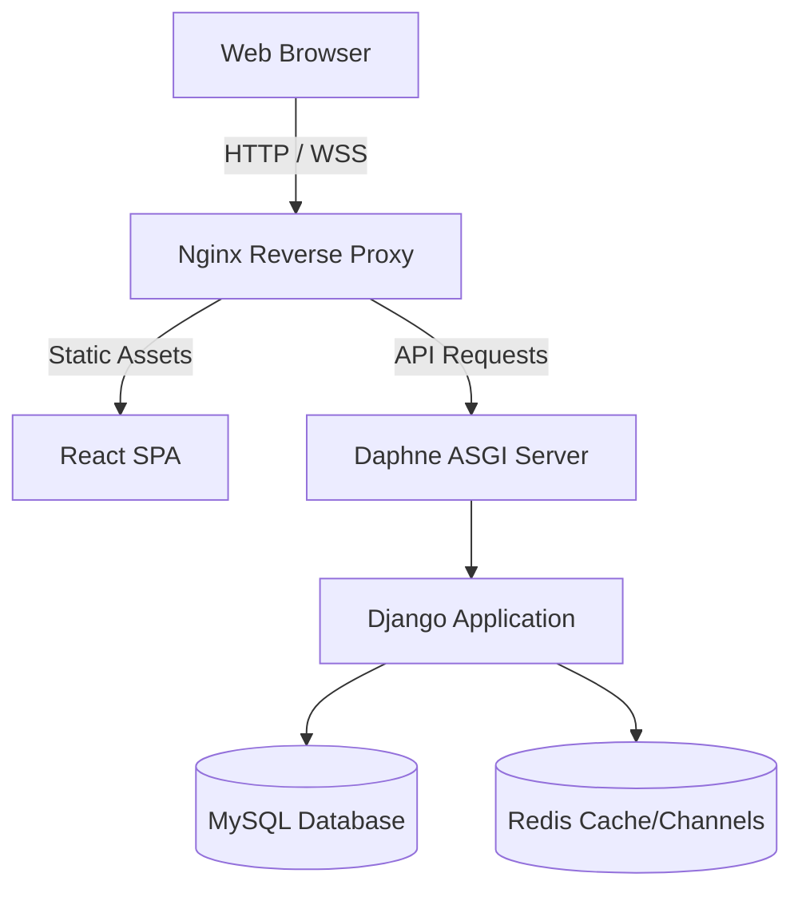

# 🏗️ Recommendation System Architecture

This document outlines the high-level system architecture, data flow, and infrastructure design of the Movie Recommendation Platform.

## 🌟 System Overview
The platform is a decoupled client-server architecture consisting of a **React SPA (Single Page Application)** frontend and a **Django REST Framework (DRF)** backend. It uses **MySQL** as the primary relational database and **Redis** for WebSocket layer management and health checks.



---

## 🎨 Frontend Architecture (React)

The frontend is built with React 18 and relies heavily on Context API for state management.

### State Management (`Context.js`)
The `UserProvider` acts as the central nervous system of the application:
1. **Boot Fetching:** On initial load, it fetches `/movie/popular/` and `/movie/upcoming/` concurrently using `Promise.allSettled`.
2. **Memoization:** To prevent render-cascading across the app, the massive `contextValue` is wrapped in `useMemo`.
3. **Local Fallbacks:** Input fields (like login/register forms) manage their state locally to prevent global re-renders on every keystroke.

### Performance Optimizations
- **Image Lazy Loading:** Heavy image assets (like TMDB posters) use the native `loading="lazy"` attribute, vastly improving Time to Interactive (TTI) and First Contentful Paint (FCP).

---

## ⚙️ Backend Architecture (Django)

The backend is an asynchronous Django application served by Daphne to support WebSockets.

### Authentication Flow
We use **JWT (JSON Web Tokens)** via `rest_framework_simplejwt`.
- The `/token/` endpoint issues short-lived `access` tokens and long-lived `refresh` tokens.
- Protected views demand valid tokens, and the frontend gracefully redirects to `/login` if intercepted.

### Real-Time Features (Channels)
Django Channels provides the backbone for real-time capabilities.
- **Channel Layer:** Powered by `channels_redis`, allowing ASGI workers to communicate across processes.
- The Redis instance operates on `redis://redis:6379/0`.

---

## 🚢 Infrastructure & Deployment

We use a fully containerized Docker architecture orchestrated by `docker-compose.prod.yml`.

### The Container Topology
1. **Frontend (Nginx):** A multi-stage Docker build compiles the React static bundle and serves it via an `nginx:alpine` image. We use a custom `nginx.conf` for SPA routing (`try_files $uri $uri/ /index.html`).
2. **Backend (Daphne):** The Django app collects static files on build and serves traffic via Daphne ASGI on port 8000.
3. **Database (MySQL 8):** Persists user data, watchlists, and movie references.
4. **Cache (Redis 7):** Handles WebSocket channel layers and acts as a ping-target for health checks.

---

## 🦅 SRE & Observability (The Canary Workflow)

### Deep Health Checks
The `/api/health/` endpoint actively verifies connectivity. It does not just return HTTP 200; it attempts to:
1. Ping the MySQL database (`connection.ensure_connection()`).
2. Ping the Redis cluster (`r.ping()`).
If either fails, the load balancer is notified via a HTTP 503 response.

### Docker Auto-Healing
All services in `docker-compose.prod.yml` contain `healthcheck` definitions:
```yaml
healthcheck:
  test: ["CMD", "curl", "-f", "http://localhost:8000/api/health/"]
  interval: 30s
  timeout: 10s
  retries: 3
```
If a container fails 3 consecutive checks, Docker will automatically restart it.

### Structured Logging & Crash Reporting (Sentry)
- **Structured Logs:** Django's `LOGGING` dictionary is configured to output pure JSON, making it ingestible for Datadog or ELK stacks.
- **Sentry SDK:** Automatically intercepts unhandled exceptions, attaching tracebacks and user request context. Enabled by supplying the `SENTRY_DSN` environment variable.
